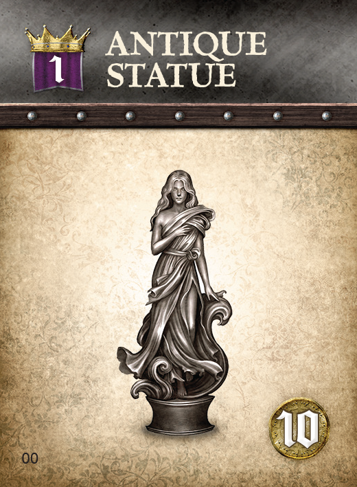
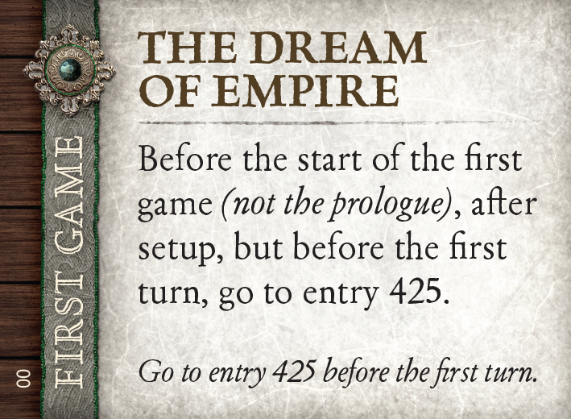
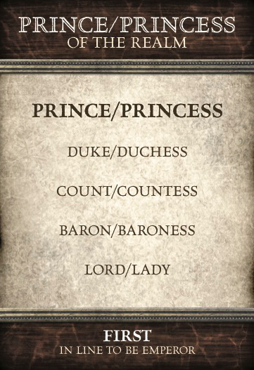
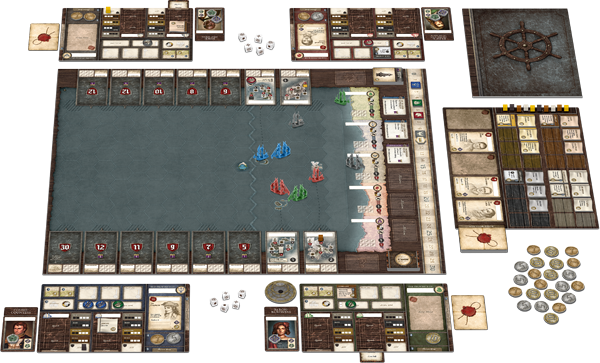
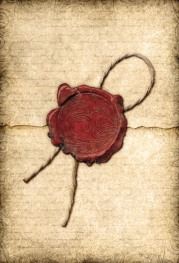

# SeaFall Preview: Setting Sail
## Designer Notes \#1: Rob Daviau invites you on an adventure
*2016-05-16*

I wanted adventure.

It was fall of 2012. I had left Hasbro the month before. Risk Legacy was a surprise success and, for the first time in 14 years as a professional game designer, I could make any game I wanted to.

I wanted adventure. I wanted the open sea, unknown islands, maps, charts, lost tombs, and a sense that something big was just over the horizon. I wanted lost treasures and naval battles and a race back to port to win the day. I wanted a game that I could show my 12 year-old self and know that he would fall in love with it.

As I told someone, "I want Indiana Jones in the Age of Sail."

For the most part, that's what SeaFall is. It's part Euro game, part Ameritrash at its finest. It has a twisting emergent story, legacy-style play, and a lot of twists and turns as players explore the seas to discover how they can bring glory to their province.

SeaFall is a 3-5 player legacy game. It is competitive. Not as cutthroat as Risk, but it has its moments of treachery. Each player is a ruler of a province and the goal for each game is to attain glory. Reach the target glory before any other player and you win the game. Players play the same province for the entire length of the campaign. The fate of your province - and its impact on the world - is yours and yours alone. Glory is tracked from game to game and the player who has the most glory when the end of the world is discovered becomes the Emperor (or Empress) who reunites the provinces at long last.

Very early on, I established the main actions you could do on your turn - raid/fight, explore, trade, or build. These stayed constant through its design and development. With those goals I set off on a three year journey of design, redesign, testing, and more testing. The game changed a lot - a lot lot lot - in those 3.5 years. At first, the game was all about ships. Each player had two to four ships plying the seas. But some early feedback showed that players wanted more than flotilla. So I added some lands to rule... and protect. On these provinces, you could have buildings, treasure rooms, fields, and other little aspects to your province that made it unique. You had a home and your ships were setting sail from there.

Every week for the next few months, I will have a design note about an aspect of the game, explaining how it works, why it's there, and how I hope you have fun with it. Being a legacy game, I can't get into everything - there are unknowns best left for you to discover yourself. My hope with these articles is that you can learn enough of the game so that reading the rulebook is short and simple and you can start playing quickly.

Here is what the next ten weeks will feature.

1. Provinces - all the parts of your domain
1. Game Structure - what you do on a turn
1. The Merchants Guild - buying and selling goods
1. The Builders Guild - building structures and improving ships
1. Dice Pools and Endeavors - how the unknown is resolved
1. The Explorers Guild & The Captain's Booke - what is out there on those islands?
1. The Soldiers Guild & Enmity - how to raid, tax, and leave lasting hatred
1. Advisors - they make everything better
1. Legacy Aspects - what changes from game to game and how milestones drive it forward
1. A developer's view (this one is going to be written by SeaFall's developer, JR Honeycutt)

Adventure awaits. The seas await. Destiny awaits.

Glory awaits.

*Written by Rob Daviau*  
*Rob Daviau is the designer of SeaFall*
