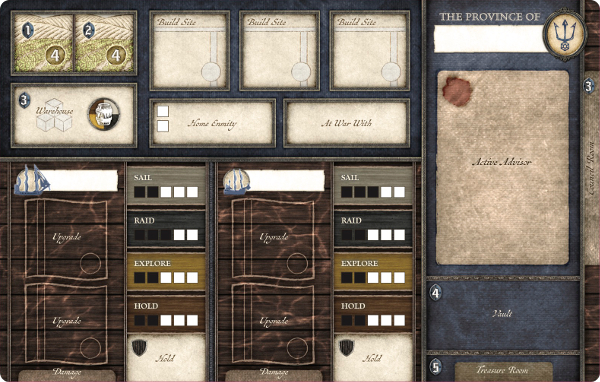
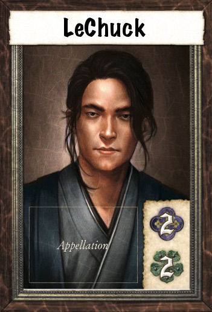
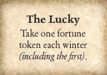
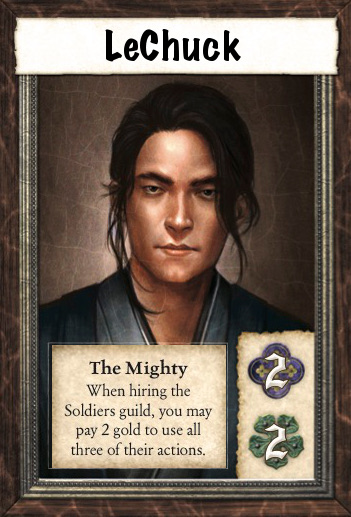
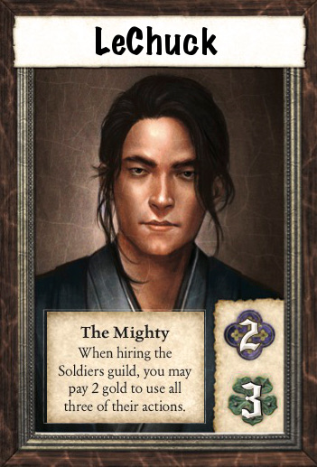
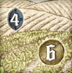

# SeaFall Designer Notes \#2: Your Province, Your Birthright

*2016-05-24*

Your province is your birthright. You inherited this power and you make all decisions. Welcome to old world monarchy. In SeaFall, you are the sole ruler of a province. No Magna Carta. No nobles. No dissent. The nice thing about a board game is that it is easy to give a player total power.

This article will look at what you control in SeaFall - your province and your character. Since you play the same province for the entire campaign, you have complete control over how your province will grow. The rules for SeaFall outline the various parts of your province. Today we'll be discussing the options for growing your province as the campaign goes on.

At the start of the prologue, each player chooses a leader card, which contains an image of the you. (Unlike $\text{17}^{\text{th}}$ century Europe, you have a variety of ethnicities and genders to choose from.) You give yourself a name and you are ready to go. *(Editor's note: "LeChuck" is what I "wrote in" for the purpose of this preview. You'll write in whatever you want.)*

There are three ways leaders can be permanently improved:

**Appellation:** Each leader can have an appellation, such as "The Wise" or "The Might". These give you a distinctive power. However, this power is only good for a very focused action. Choose an appellation if you think you'll be specializing on one type of action guild.

**Fortune:** Fortune mitigates bad dice rolls and creates victory from defeat. Increase your fortune if you plan on raiding or exploring a lot.

**Reputation:** Most of the time you will use reputation to get advisors rather than paying gold. Advisors give you a lot of flexibility, allowing you to customize your turns without losing efficiency. Increase your reputation if you plan on hiring a lot of advisors and remaining flexible.

Your province contains two different features that can be improved: your garrison and your fields.

**Garrison:** Your garrison protects you from raids from other players. A raiding province loses dice from their endeavor pool equal to your garrison. If you are playing a game with a lot of PvP raiding, increasing your garrison gives you peace of mind without having to spend time and money on defensive buildings to protect yourself.

**Fields:** Your fields generate gold for you every winter (including the start of the game). At the start of the campaign, each province has two fields worth 4 gold each. It is possible to double this, over time, to two fields for 8 gold each. At the start of a game, players have no goods, so structures and upgrades must be paid for all in gold. Also, if you want to buy a lot of goods, you will need plenty of gold to do so (otherwise you will have to raid for the goods). Upgrade your fields if you plan on trading and building as it will give you more income to spend each year.

Finally, you will control two ships, which are your main agents in the world. The ships start almost the same, each with an explore and hold of 2. One is a bit faster with a sail of 3; one is a bit mightier with guns of 3. At the end of each game, you will get to improve one stat on one ship. You may choose to pour all your improvements into one ship, making one clearly the better ship, or spread it out. Also, you have four stats to improve:

**Raid:** The world is dangerous. More guns means a better chance to raid. If you want to take by force (or even threaten to take by force), raiding is for you.

**Explore:** The world is largely unknown. Increase your explore value if you want to be the one exploring the world.

**Sail:** The world is big. In a game with limited turns, being able to get someplace faster might make the difference between winning and losing.

**Hold:** The world is rich. There are a lot of things to find out on the seas and it would be a shame to not be able to take it all because your hold is tool small. Though not the sexiest of options, increasing you hold means you can stay out on the seas longer without having to come home to unload your goods at home.

*Written by Rob Daviau*  
*Rob Daviau is the designer of SeaFall*
