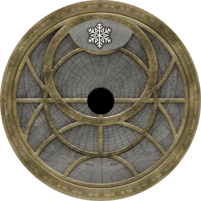
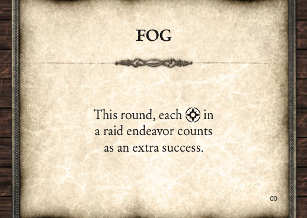
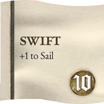
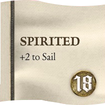
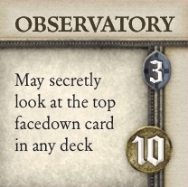

# SeaFall Designer Notes \#3: The Weather Turned

*2016-05-31*

I knew from the beginning that SeaFall would have seasons and years. Earlier versions were more literal with spring, summer, fall and winter. The final version ended up with six rounds and winter. The mechanics of the year/round/turn are in the rulebook, so I won't go into much detail about how they work. Instead, I want to get into how to maximize your rounds and years so that you can crush your opponents.

SeaFall is a game about timing and pacing. What you do on a turn is fairly straightforward - select one of the four guilds and do two of their three actions. Maybe you buy an advisor or treasure beforehand. Do that six times and you've had a game year. Most of the games last a little over two game years. So each player will get about 12-15 turns or 24-30 actions.

Using all your actions efficiently is what allows you to get more glory and progress in your quest to become emperor. It is very easy (and actually quite enjoyable) to sail aournd turn to turn, taking opportunities when and where you see them. But being able to plan out a few turns in advance will lead to more efficient play.

## Winter

The game starts with winter, and you will likely have two more winters before the end of the game. During winter you harvest your fields and fill up your treasury with gold. Also, all your advisors refresh so that you have access to all of them. The islands regain their goods. In short, your first turn after winter usually gives you the most options for that years.

If you want a ship upgrade, make sure your ship is at a dock during winter so that you can upgrade right away and then immediately sail away. If you want to buy a lot of goods, be docked at the island you want to buy from. If you want to make a raid, have your ship within sailing distance of your target; during winter, enmity tokens move off of the previously raided site, plus you'll have access to all of your advisors.

## Events

 

Knowing which event cards are in the deck and which have come out can also help you plan the back half of a year. If you that a card that makes selling goods more profitable hasn't come out yet, you can hold off selling goods for a round in the hopes that this event card comes out the next round.

## Sailing

Distance is a real factor in SeaFall. Getting from island to island takes time (and actions) and you don't want to be at sea in between islands any more than you have to be. In the early gmaes, this will happen more often as the sail values of your ships are low. An early sail upgrade not only gains you glory but can allow you to save actions later in the game by getting where you want to go in one action instead of two.

 

## Goods

Most things you control in SeaFall are abstract - gold and advisors can be used anywhere without being assigned to a ship. (Earlier versions attached them to ships, which led to a painful game of record keeping.) Goods, however, have specific locations and must be tracked. If you use a good to discount an upgrade, structure, or treasure, the good must be in that region. Plan ahead. I've seen people's plans get waylaid because they have the wrong good in the wrong place at the wrong time. The different goods will also lead you down different paths by helping you in different ways:

* Iron helps with raiding and defense against raids
* Spice helps with exploring
* Linen helps with sail, planning, and merchant actions
* Wood helps with hold and running your province more efficiently

Come back next week for a detailed discussion of the Merchants Guild!

*Written by Rob Daviau*  
*Rob Daviau is the designer of SeaFall*
