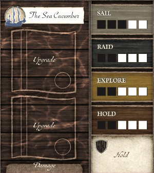
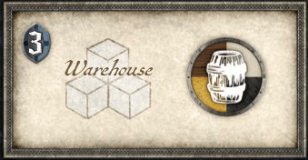
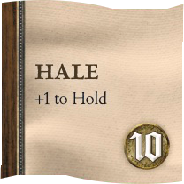
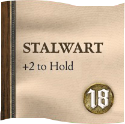
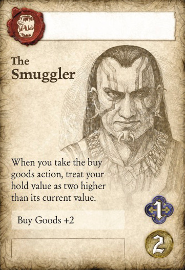
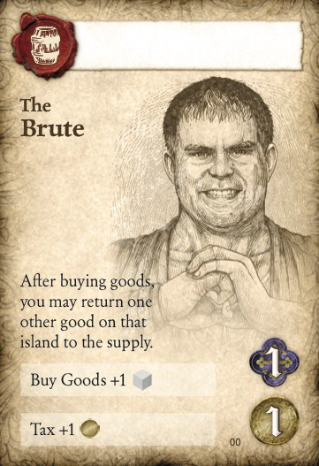
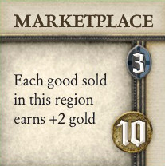
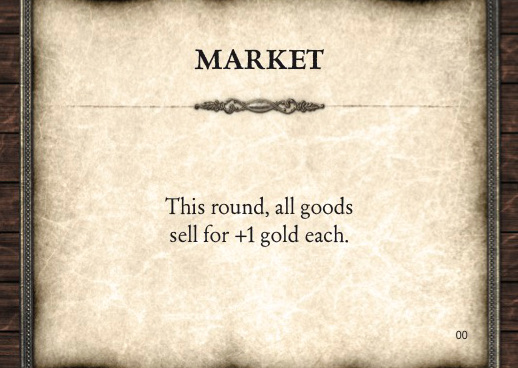

# SeaFall Preview: Gold!
## Designer Notes \#4: The Merchants Guild
*2016-06-07*

What kind of adventure/sailing/exploration game would SeaFall be if you didn't get a chance to have a huge pile of gold in front of you?

Today we're going to look at the Merchant Guild, the most straightforward of the four guilds you can hire on your turn. Merchants are really here to turn gold into goods and goods into more gold. If you use the Merchants Guild often, you should be able to turn a nice profit, which can allow you to buy the advisors, structures, upgrades, and treasures you want.

Like every guild, the Merchant Guild has three actions: Sail, Buy Goods (2), and Sell Goods (2). On your turn you will be able to use two of them.

## Sail

Sailing, which works the same for every guild, allows you to move both your ships to their sail value. They can move together or separately. But do note that EACH ship can move up to its FULL sail value.

Before a ship starts its sail action or after it ends its sail action, you are allowed to rearrange what is in its hold provided the ship is at land (not out in the open sea). For example, you could sail back to your home harbor and unload your goods to your warehouse. Or you could move goods between your ships if they are at the same island. One trick is to buy goods on two different islands, then move your first ship to your second ship, transfer the good to the second ship, and the sail the second ship home with both goods. This chaining of sail actions allows a good to go twice as far in one turn than keeping them on their original ships.

## Buy Goods (2)

When you take this action, you may buy up to two goods from any islands where you have a ship and place them in the holds of those ships. You pay 3 gold for each good bought. Pretty straightforward. Here are a few notes about buying goods:

* The goods must be for sale at the island. Each site on the island produces one good every winter that it is available for sale. You mark these with plastic cubes put onto the island inset box. If that good isn't there (it may have been bought already or raided or otherwise removed due to something that happens in the Captain's Booke), you cannot buy from that island.
* For every enmity of yours at the island you are buying from, the cost of a good goes up by 1 gold. We'll get into enmity in detail when we talk about the Soldiers Guild.
* You have to have room in your ship's hold to put the goods. Each ship can carry goods and items equal to its hold. What item can you carry you ask? You'll see...
* You can buy different goods from different islands as long as you have a ship at each island you are buying from.

## Sell Goods (2)

When you take this action, you may sell up to two goods from any location that has the market symbol. At the start of the campaign, this is only the warehouse in your province, but explorers will find sites out on the islands where anyone can sell goods.

A market symbol either shows all four goods colors (the one in your province is marked this way) or only one color (the ones on the islands will be marked this way). When you sell goods, you get 6 gold for each, which is put into your treasury. Again, a few notes:

* You may sell in two different markets, as long as the good being sold is at the market symbol. In the case of goods being in your warehouse, this is obvious. But a good may be at a ship at an island containing a market as well.
* Although enmity affects the price of buying goods, it does not affect the price of selling goods at an island.

## Merchant Advisors, Structures and upgrades

The merchant path, without any boosts, usually requires four actions to make 6 gold. You sail, buy, sail back home, and sell. During this time you buy two goods for 6 gold and then sell them for 12, making a profit of 6 gold. While nice, you will need to improve this cycle in order to make some real money.

 

There are some starting game upgrades that you can add to your ships, increasing their hold. This allows you to put another one or two goods in your ship, which will cut down on sailing back and forth. But, with the limit of only buying and selling two goods, this will only help a little (besides the fact that each upgrade gives you a glory).

 

Merchant Guild advisors often have an expertise that let you buy or sell more goods with the buy/sell action. Furthermore, some give discounts in gold when buying or increase your profit when selling. We will talk about advisors in detail in a later article.

The marketplace structure allows you to sell each good sold in that region for +2 gold. This drastically increases your profit margin.

Finally, the event deck starts with two cards that help merchants - one discounts goods bought that round by one gold and another lets them sell for one extra gold when sold that round. If you have even a few of these boosts and bonuses in effect, it is possible to sail, buy 3 goods in one action at a cost of 1 gold each, sail home, and sell all 3 goods for 9 gold each. This gives you a profit not 6 gold but of 24 gold for the same four actions.  

*Note, to realize this profit the following would have to happen: during a goods event turn The Dockmaster advisor is played before purchasing goods. On a later turn (hopefully the next turn) you would play The Master Trader advisor during a market event and then sell the goods. If the marketplace structure happened to be built on an earlier turn, then those 3 goods would sell for 11 gold each for a profit of 30 gold. Needless to say, so many boosts and bonuses are needed to achieve this large windfall that seeing it happen in a game would be a rare feat.*

## Merchant Path to Glory

The Merchant Guild is the only guild where you do not usually gain glory by taking its actions. Instead it gives you the tool (gold) to get the glory elsewhere. With gold in your vault, you can buy upgrades and structures, all of which give one glory (and have a power). More importantly, a full vault lets you buy treasures at the start of your turn, which are worth glory while you own them. Treasures can be raided by other provinces but the treasure room is the hardest room to raid so your treasures are often safe there if you are in a campaign with a lot of PvP raiding.

Finally, keep an eye out for any islands that have a market that matches the type of good also produced on the island. If you are in position after winter, you can buy one (or more) of a good and immediately sell that good to its market without having to sail anywhere.

Next week: The Builders Guild!

*Written by Rob Daviau*  
*Rob Daviau is the designer of SeaFall*
