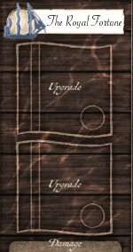
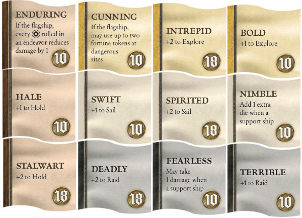
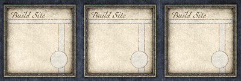
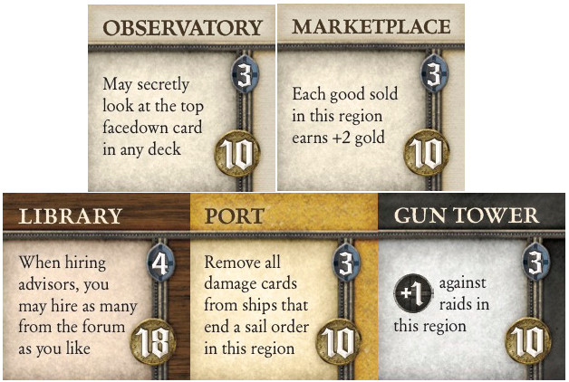

# SeaFall Preview: The Fearless, Nimble Royal Fortune
## Designer Notes \#5: The Builders Guild
*2016-06-13*

This week we're going to look at the Builders Guild, whose job it is to make your ships and your province better and stronger during the game. They are also there for you in case you need some repairs.

The main items you can build are ship upgrades and structures, both of which are stacked face up on the sideboard. Each one of these that you build counts as one glory for as long as you have it. With four upgrade slots and three building spaces, you can have seven glory from building and you get the advantage of the upgrade/structure's power. Of course, structures can be raided and ships can be sunk, so your glory is a bit temporary in nature if you aren't careful.

The game starts with 12 different ship upgrades and 9 structures (5 different structures with some duplicates). Let's walk through the Builders Guild actions to see how you gain them.

## Sail

This action is the exact same across all four guilds. It was covered in the article about the Merchants Guild so just hop back there to read it and then hop back here.

## Repair or upgrade_spots

When you take this action, you must choose whether you are going to repair a ship or upgrade a ship. You cannot do both.

**Repair:** To repair, you must have a damaged ship at a location with a repair symbol. Each home harbor has one and there is one out on the fourth island. There is no cost, usually, to repair. You spend the action and remove all damage cards from the ship. Also, if there are any exhausted upgrades on the ship, those get refreshed.

**Upgrade:** To upgrade, you must have a ship at a location with a dock. Each home harbor has a dock showing all four colors and upgrades, meaning all four can be bought here. Later, on the islands, you'll find docks of only one color. At those docks, only upgrades matching the color of the dock can be bought.

Each upgrade has a poser that it adds to its ship as long as it is active. Also, each active upgrade can be used to absorb one damage. A ship can only have two damage cards - a third makes it sink. A ship with two upgrades essentially can absorb four hits instead of two. To absorb damage, exhaust (turn over) the upgrade. You still get the glory for it but you can no longer use its power.

We had some fun with the upgrade names. Over the years of development they were types of crew or additional equipment or changes to the ship itself. At the end, we settled on each upgrade being an adjective that described its power. This way your ship could have a real sense of swagger with some upgrades. The Captain's Hand with a full complement of guns becomes the Terrible, Deadly Captain's Hand. I'm hoping to read session reports that use this language.

Here are the starting upgrades.

As you can see, all four stats on a ship have both a +1 and +2 boost, costing 10 gold and 18 gold respectively (remember that spending a good of the color matching the upgrade lowers its cost by 8 gold). There are also four - Fearless, Nimble, Enduring, and Cunning - that have a power rather than a stat boost.

## Build Structures

This action allows you to build a structure on any build site you control. No ship is needed there so you can build back at home while your ships are out at sea. Like upgrades, the cost of the structure is discounted by 8 gold if you spend a good. The good must be at the same location as the build site so that iron on your ship out to sea can't be used to discount a Gun Tower back on the mainland. It's your decision whether it's worth the time to go back.

Each structure gives a power either to its leader (that's you) or to the region it's in. Players can use reputation to use others people's structures if they are in the same region as the structure. This is unlikely to come up in early games.

Unlike the starting upgrades, there are multiple copies of some of the starting structures. Here they are:

* The Gun Towers (3 of them) help protect your province from raids. A good idea in a PvP world. Otherwise, you'll be compelled to leave a ship back home as a guard.
* The Marketplace allows you to sell goods for +2 gold each if you sell them at your market. A big boost to the Merchants guild.
* The Observatory lets you look, at any time, at the top face down card of any deck, including the event deck.
* The Library (2 of them) allows you to buy more than one advisor from the market.
* The Port (2 of them) allow you to repair ships without having to spend an action.

## Builder Path to Victory

There are some Builders Guild advisors that will provide deep discounts. Get those early (or keep one from the game before). Head out early to grab some goods to immediately be able to upgrade a ship or build a structure. Doesn't matter if you raid or buy goods. Upgrading ships pays an immediate dividend in that those ships are now able to go out and get more goods to further build with. Since the glory from building is capped at seven at the start of the campaign, you will need to either buy treasures or raid/explore to get to victory. But with the powers of structures and the robustness of upgraded ships, you can really succeed in the second year of the game whether you are sailing faster, hitting harder, or exploring further.

Next week: Endeavors!

*Written by Rob Daviau*  
*Rob Daviau is the designer of SeaFall*
