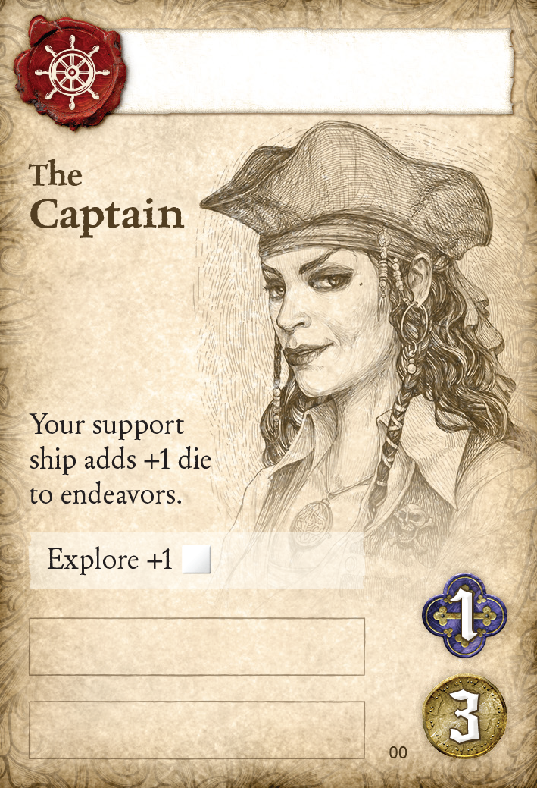
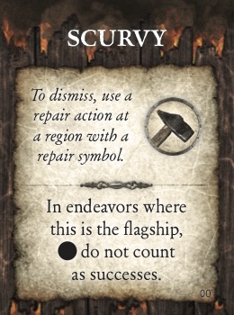
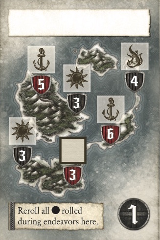

# SeaFall Preview: Adventure!
## Designer Notes \#6: Endeavors for Glory
*2016-06-20*

I knew, from the start, that SeaFall would have a sense of adventure. There would by mystery, the unknown, the unpredictable. There should be moments of great drama where the unexpected happens, either for good or ill.

In short: I love Ameritrash. Nothing quite feels the same as rolling a natural 20 while playing D&D and I always want to capture that moment the best I can.

Today we're going to look at endeavors, the game term for rolling dice and seeing what happens. If you've read the past two entries, you'll note that the Merchants Guild and Builders Guild are very much in the euro style of play. There's no luck and no uncertainty. If you want an upgrade then you can get it, provided you have the resources. The only element of chance is whether someone else takes it before you do. If you like games that are more engine building and euro in design, then those two guilds are for you.

If you like a little bit of swashbuckling, let's talk endeavors.

Endeavors are the fancy term for getting a dice pool and then rolling it to see how many successes you got. Each endeavor is based on a stat of one of your ships and can be boosted in many ways. The two actions in the game that use endeavors are Explore and Raid. Those will be explained in detail in future articles - today we look at the underlying mechanics.

## Flagships

When attempting an endeavor, you start by naming one of your ships in the region as your flagship. If only one ship is at the region, that ship is the flagship. The flagship adds its full efforts to the endeavor but is the one that will take damage if the endeavor goes wrong.

## Dice

Each endeavor has a ship stat that defines it. For example, a raid endeavor uses the raid value of the ship while an explore endeavor uses its explore value. You start by taking dice equal to the current level of the stat you are using. Don't forget to add dice for upgrades and remove them for damage (if the damage card calls for it).

To this you will add dice for:

* Support ship. If your other ship is there, you add 1 more die.
* Advisors add dice if their expertise matches the ship stat you are using
* Things that come later in the campaign

Sometimes you will lose dice due to event cards, enmity, or garrison (which will be talked about in full when we discuss the Soldiers Guild).

## Successes

   

The dice in SeaFall are custom and contain the following faces: two blanks, two standard success, a weak success, and a strong success. Basically it is four successes to two blanks. Most of the time that's all that will matter.

Count your successes.

## Damage

Each endeavor has a defense number. If you roll equal to or higher than the defense then you succeed without taking any damage.

If you have fewer successes than the defense, then you will take one damage for every number you were under. For example, an endeavor has a defense of 4. You roll two successes. You missed by 2. Take two damage.

 

## Successes

If you don't roll a single success in the endeavor, then you fail it, regardless of whether your ship can take damage or not. I mean, zero successes means not successful. This is a rare case, though.

Mostly, you succeed in an endeavor if you don't sink in the process of the endeavor. You *do not* need to hit the defense number; you just need not sink. That is where one of the big decisions comes in SeaFall - how many dice do you think you need to not sink vs. how many do you need to not take damage?

For many people, they don't want to take any damage from endeavors. This saves them from taking damage cards (which almost always limit your ability to function) or exhaust upgrades (which definitely reduce you ability to function). It also saves them from going to a region with a repair symbol and spending an action to repair. However, this means making sure you have a good amount of dice and the extra turns gathering the right upgrades, powers, and advisors might be the same amount of turns you would've spent repairing.

On the other hand, being too risky is a short-term benefit. Being willing to soak up a damage or two means you might be able to tackle a higher-defense endeavor or get to an endeavor faster since you aren't spending time building up. However, cutting it too close to the edge means one slightly bad roll and your ship is sunk with all its hold and upgrades.

How you thread this needle is up to you.

## Fortune

Each leader has a fortune rating and starts the game with fortune tokens equal to their rating. These tokens are used to fix pitiful dice rolls. After a roll, you may spend fortune tokens. Each one turns a die into a standard success. It doesn't add successes but it can make sure your dice behave. It's hard to get fortune back during the game so this is a limited opportunity but smart leaders will find a time to suddenly do the risky without taking a risk.

Little note: Some sites have a red defense symbol, so you cannot use fortune here unless you have an advisor or power than says otherwise.

## Glory

With treasures, upgrades, and structures (discussed in earlier articles), there is no risk in gaining the glory but this glory could be taken from you in a raid or a mishap at sea. So the risk is in holding the glory, not gaining it. With endeavors, the risk moves to the front. Once you succeed in an endeavor, you gain a glory and that glory is yours to keep. Since the glory gained was already a risk, you won't lose it on a future turn.

Next week: The Explorers Guild and the Captain's Booke!

*Written by Rob Daviau*  
*Rob Daviau is the designer of SeaFall*
