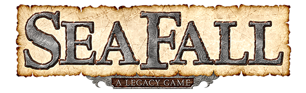
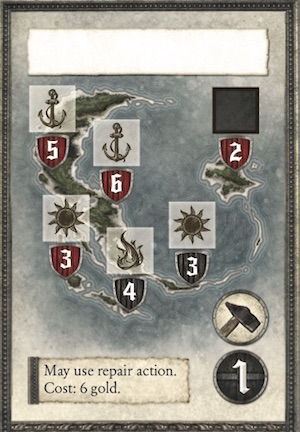

# SeaFall Preview: In Search of the Unknown
## Designer Notes \#7: Exploring and the Captain's Booke
*2016-06-27*

This week we're talking exploration. The heart of the game. When you start SeaFall, very little is on the board compared to how it will look 15 or so games later. Only four columns have islands. Of those, only one site on each island is known.

The key to unlocking all this mystery is the Explorers Guild. You will use the Explorers Guild to explore islands, XXXXXXX for XXX XXXXXXX, and even XXXXXXX XXXXX of XXX XXXXXXXX! As you can see, there's a lot going on with the Explorers Guild. Today, we'll focus on what you can do with them at the start of Game 1.

Like all guilds, the Explorers Guild has three actions. Here they are.

## Sail

This action is the exact same across all four guilds. It was covered in the article about the Merchants Guild so just click back there to read it and then hop back here.

## Explore

When you take this action, you choose an unexplored site where you have a ship and attempt an Explore Endeavor (endeavors were covered last week). Note that the site you choose must be unexplored - you can't explore a site that produces iron or has a mine. Everyone already knows what's there.

If the site is red, it is dangerous and you usually can't use fortune there. Different sites have different symbols on them. In general, the symbols with harder defense numbers yield better rewards for exploring them.

Assuming you succeed in the endeavor - i.e., don't sink and get at least one success - you will then go to the Explorers Map on the opening spread of the Captain's Booke to see what you found. You choose one number on the map that matches the symbol of the site, cross it out and go to that entry number.

The Explorers Map is an abstract concept that represents all of the unknown sites in the world rather than any one island or location. By putting them all on one map, it ensures that each group's world will be different. I have no idea what symbol or number you will pick or in what order you will explore the world so I had to make sure they worked in any order.

The Captain's Booke entry will almost always give you a dilemma faced by the captain of the ship doing the exploring. Perhaps the crew is restless. Perhaps you have trouble with the natives. Maybe the captain thinks that time is short or it is worth pressing on. You briefly take on the role of this captain. After hearing the dilemma, you will choose a course of action, which will lead you to another entry for the final outcome. This will always lead to the site being marked from the sticker sheet to show what was found there. Depending on the situation and the course of action, there may be rewards, penalties, or other mishaps along the way.

Also note that I tried to write these captains as a very traditional colonial lot - full of bluster and the certainty that their province has a divine right to do whatever it wants. This was done to get into the mindset of 17th century European explorers. I am fully aware that this attitude is a poor fit for most 21st century people. If you want to hear some of these Captain's Booke entries, Plaid Hat Games is releasing a series of videos that contain excerpts from the Booke. (some are fabricated, some are actual entries).

## Research

It's a bit tricky to talk about Research since that action, although technically available at the start of the game, is sort of a false choice as there are no Research cards at the start of the game. As the rules are in the book, I'll get into them a bit here.

The Research action (no ship necessary), allows you to draw X cards from the Research deck and then keep one. Most of the time, X is 1, so you draw a card and keep it. But the Research cards are not created equal - some are clearly better than others (although all are useful).

Research cards are a way to explore higher and higher defense sites and/or eliminate the luck of endeavor dice. Without getting into it too much, they are another tool to decide where your appetite is for caution vs. throwing caution to the wind.

Research cards, as noted, carry over from game to game. That doesn't mean they can't be raided. We'll get into raiding in depth next week when we do a deep dive into the Soldiers Guild.

## Explorer Path to Victory

You get one glory for an endeavor, so a successful exploration will always be moving you toward your final goal. Almost always you will gain something - gold, goods, upgrades, etc. - by exploring, so you don't have to spend extra actions and gold to obtain these items. The downside is that you never know exactly what you'll find when you explore so you need to be flexible if you choose this path. A sudden discovery of iron might lead to upgrading the raid value of your ships for a quick raid. Discovering wood might make you want to build a structure or treasure. Exploration is the search of the unknown and the unknown can surprise you.
