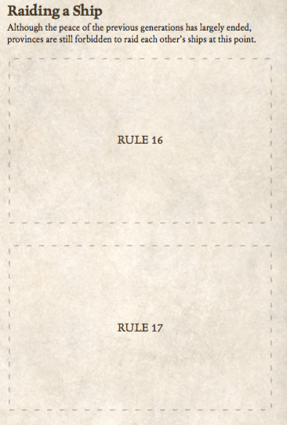
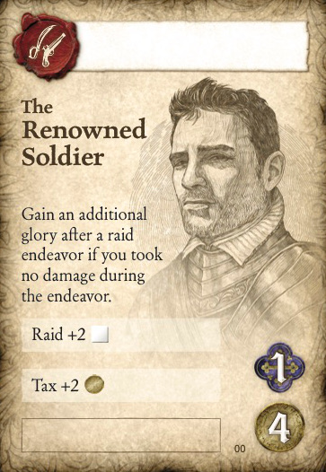

# SeaFall Preview: The Price of Hatred
## Designer Notes \#8: Emnity and the Soldiers Guild
*2016-07-05*

## The Price of Hatred

War. Raiding. Piracy. Aggression. Theft. What game about ships avoids these? Some days while designing, I wished fervently that Seafall didn't have them. Of all the elements of the game, getting the Soldiers Guild to work took by far the longest. The end result works well but takes some effort to understand. I already know that enmity and how it works will be my main focus on message boards.

From the start I wanted cannons firing, people stealing cargo, sinking ships, and burning down buildings. It was the opposite of the merchant guild; retail is for suckers, those with might just take what they want.

*An excerpt from the rulebook. Players may not raid each other during the prologue. During game 1, raiding provinces is available, but raiding ships is not possible.*

Rather than go through the exact ins and outs of each action (hint: take the Soldiers Guild and Tax when you've got nothing to do other than sailing in a turn) I thought I'd take a look at raiding and where it fits in the SeaFall world.

## Zero Sum

When used against islands, raiding works like buying - you take something. But, instead of paying gold, you pay with enmity. There were never issues with this in the game. But, when you got to player vs. player combat, everything got weird. It's a zero-sum game. If I take something from you, you lose it and I gain it. Glory shifts dramatically. Power shifts dramatically.

What happened in many early versions is that the player who was going the military route dictated the game to the other players. If you were exploring and I was trading, we would rarely overlap. Even if we were both exploring, we'd only gain friction when we sought the same sites. With raiding, your raids can disrupt my game so much that I was forced to focus on raiding as well.

This was an issue and it took up months and months of my time. Here's how it all got resolved for the final game.

## Enmity

Enmity is a currency in the game. Each player has eight enmity tokens to spend on hateful actions per game. There are some ways to get them back but you don't earn more. By capping enmity to eight tokens, it meant that one person could only be so aggressive in one game. When you raid the islands, you spend one enmity for your actions. This means that you can likely raid the islands all game without running out. The game usually has about 12-15 turns so raiding eight times is a lot.

However, raiding another player eight times would effectively ruin their game. If they did nothing, they would lose. If they increased their guns and got revenge, they would ensure that their attacker got brought low but neither would be likely to win. Also, I wanted to make sure that trading raids (gaining a glory each time) wasn't a viable, boring path to victory.

Eventually, I (along with my developer JR Honeycutt) settled on making province sites cost a variable amount of enmity. If you raid my fields, it might cost you 2. If you raid my treasure room, which stores my most valuable cards, it will cost you 5. With only 8 enmity per player, you can only raid one treasure room per game, perhaps two if you find a way to get enmity back.

*The blue diamond symbols show the successes needed - and the enmity given - when raiding each province board site.*

## Short Term Consequences

When you raid an island, your enmity goes on the raided site to show that it can't be raided again this year. It also makes it harder to raid from that island as each enmity increases the garrison of the island when against you by one (i.e., removes a die from your raid pool). Goods on that island also cost one more gold to buy for each enmity a province has with it. Come winter, the enmity moves off the site but stays on the island. The site may be available again but the penalty for raiding stays.

With provinces, the immediate effect during the year is the same - the site can't be raided and the garrison increases. Come winter, there's something different with a province. The enmity moves to the At War With section of the province board. This is the opportunity for the aggrieved party to get revenge before the end of the game.

When a province is at war with another province, they get two distinct bonuses: they add one raid die against their foe for each enmity they hold of that foe. This is a way to boost your raid pool without having to spend the extra time and energy. Also, when you give enmity out to someone you are at war with, you return their enmity first, which means that you don't have to use a precious resource when getting revenge. There are also some advisors that also help provinces that are at war with other provinces.

This seems to work in giving people a chance to make a decisive strike against another province without getting away scot free or forcing the other player to change her strategy too much.

## Long Term Consequences

At the end of each game, players have a chance to take back enmity tokens that are on the board. It isn't guaranteed but there's a chance. Any that remain on the board become permanent. They don't afford the At War With bonuses in future games but they are a nice standing defense against people who have earned it.

If you raid my treasure room and leave five enmity, there's a chance that all five permanent enmity boxes of mine will be filled with your enmity in the next game. This means I can almost certainly relax against your ships for that game and possible many more.

## How much province raiding is there?

Raiding other players is not essential to the game. It is there thematically and also as a way for a player to snatch victory from another player. As seen above, this will have long-term fall out but there is something exhilarating about stealing a valuable treasure from another province to secure a sudden win.

The other player may not feel the same way.
