# SeaFall Preview: I Gathered a Trusted Council
## Designer Notes \#9: The Legacy of Advisors
*2016-07-05*

## Advisors: The Early Days

In the very early days of SeaFall, players had action cards that let them take one of the four major actions (fight, explore, trade, build). There was a little bonus to them and they aslo determined action resolution. Action cards kind of worked but very soon after they became advisors as people are more interesting than things. Each province had a hand of starting advisors and you could play one per turn to take their action. Around this time, the advisors became part of guilds.

This system evolved a bit (the advisors got special powers somewhere along the way) but stayed largely the same for the middle part of the game's design. There was always the nagging problem that you needed an advisor on your turn. If you were out of explorer guild advisors, you couldn't explore until you hired a new one or waited until winter. I had hoped that this would encourage hiring a diverse council of advisors but, in reality, it just led to a lot of turns where people said "I can't do what I want to do."

Eventually I settled on the guild action system that is in the final game where you can do anything on a turn (well, anything from one guild) - no advisor needed. But I still wanted advisors in there. So I made sure they were important.

## The Role of Advisors

Advisors let you do everything better. While you can have moderate success without them (especially in the early games), you are unlikely to rise to greatness without hiring effectively. Advisors let you explore further, hit harder, sell more, buy more, build more, and do more. Every advisor has its expertise at the bottom of the card, which gives you a bonus to one or more actions. More interestingly, they have a power that makes them unique - a little personality to add to your province and your turn.

## Out Starting Advisors

There are 20 advisors at the start of SeaFall, five from each guild. Their prices range from 1 to 4 gold (or 1 reputation). Here they are:

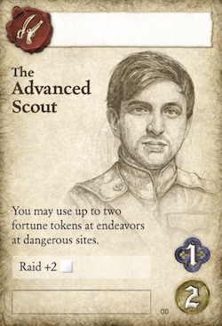 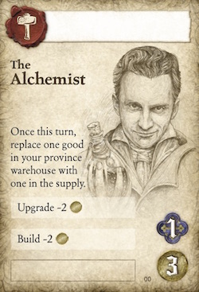 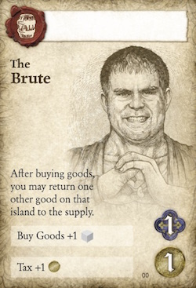

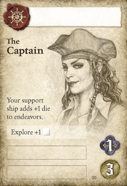 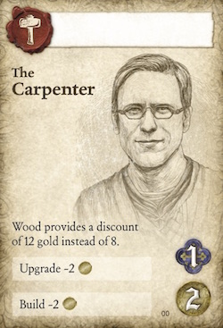 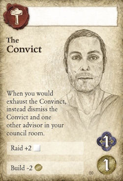

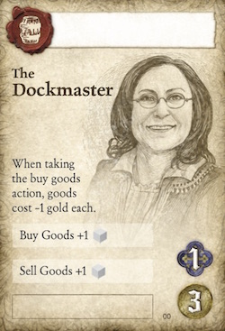  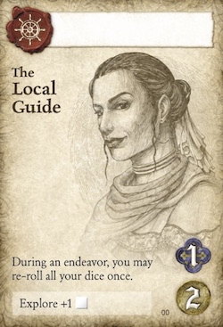

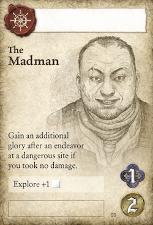 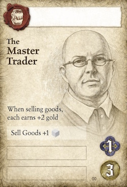 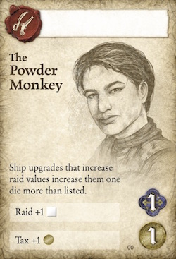

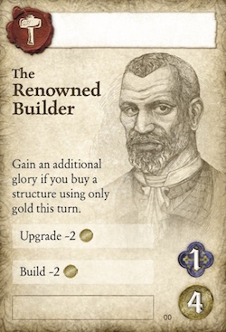 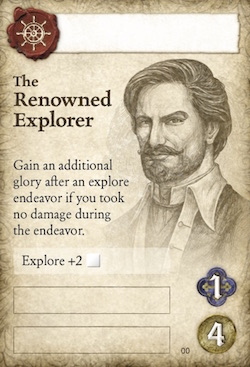 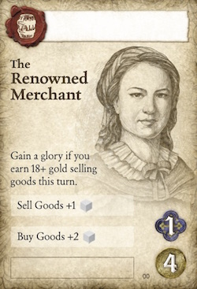

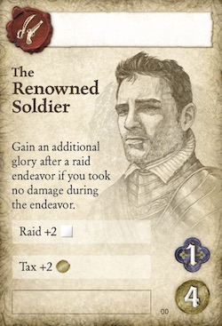 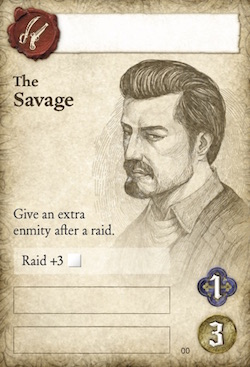 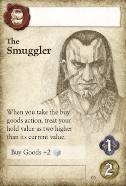

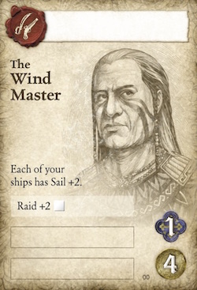 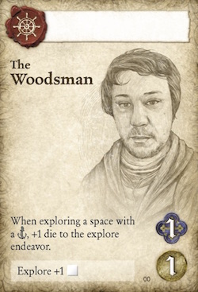

## Using Them Well

Since an average game of SeaFall lasts about two game years, you need no more than six advisors for a game - each would be used once per game year. In reality, you might need only 3 or 4 in one game but might find you use 7 or 8 in another. Keep an eye on the glory track - once you get near the end of the game, it is better to buy a treasure at the start of your turn than an advisor.

## The Legacy of Advisors

Advisors are your trusted allies. Well, until another player hires them in a different game. When you hire an advisor who doesn't have a name, you get to give them a name if you so feel like it. This was (oddly enough) a relatively late addition to the design and it made a world of difference. The Carpenter is a fine title for a card, but "Hammerin' Thom, the Carpenter" has a bit more of a memorable feel. You will see these people throughout your campaign. Some you will love, others you will hate, and some will never quite rise up to gain your attention. The illustrations are all based on playtesters who helped make the game what it is. It's fun to see my friends' faces in the mix.

At the end of each game, two things happen to advisors - each province trains one and each province keeps one. There are exceptions at times but that's the general rule.

You will most likely train the advisor you are keeping but not always. That advisor might already be fully trained, for example. You will decide whether you want your advisor to be really good at one expertise (I've seen some terrifying admiral/pirates with Raid +8) or diversified across different guilds (giving you flexibility). If I did my job right, there is no correct answer.

Who you keep will set the course for your province's first few turns in the next game. Want an early cheap upgrade? To raid your neighbor? Corner the iron market? Depending on who you keep, all these could be great starting gambits for your next game.

*Written by Rob Daviau*  
*Rob Daviau is the designer of SeaFall*
