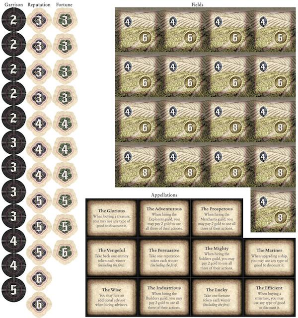
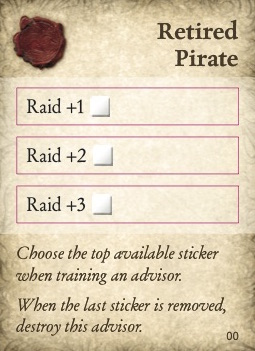
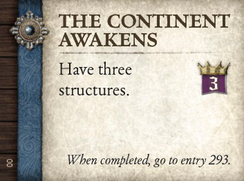
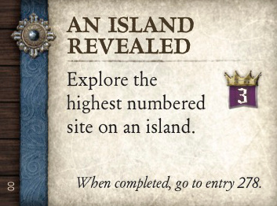
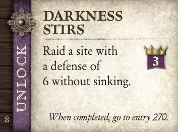

# SeaFall Preview: Who Tells Your Story?
## Designer Notes \#10: Your SeaFall game's evolution
*2016-07-19*

SeaFall is, obviously, a legacy game. From the very beginning, I knew that some actions would carry over from one game to the next. The whole idea of the game was to write a living history of a world and slowly reveal the world's past as players write the world's present.

Easier said than done.

Throughout the development of the game, the victory conditions of SeaFall changed a lot, as did what elements were "legacy" elements of the game. At various times, players could increase their fleet from 2 to 3 to 4 ships permanently and structures built in one game carried forward to the next. Scoring was sometimes abstract, sometimes thematic, sometimes revolved around the guilds, and often had runaway leader issues.

## Lessons

Each legacy game has to be its own game, and winning that game needs to be important. When unlocking new ship classes was a legacy element, players would spend *games* trying to get the next ship class. If they didn't, they wasted a game. If they did, everyone else was going to lose until they caught up.

This made the legacy portion of the campaign more important than the individual games and I saw a playtest group break this badly. Each wanted to position themselves to win games six and onward so games 1 through 5 were warm ups where losing didn't matter as you built your long-term legacy engine. I also have a good friend who may be emotionally scarred forever by her trying (and failing) to get the next ship class for four games in a row.

Structures, for a long time, were legacy components. In the real world, you build a building and they tend to stay up until someone takes them down or a lot time has passed. But this causes all sorts of issues. These PermaBuildings had to be low-powered, otherwise their permanence caused an imbalance. But their lower power effects meant they weren't worth the effort to raid, so they stayed for game after game after game.

If the power level got higher, the price needed to go up. Now they were worth raiding, but this just made the person who bought it furious, as they paid a lot of gold for it. I tried through many iterations to figure out an answer and then the answer was to make structures go away at the end of the game. Narratively I've decided that all the provinces built really crappy buildings with poor foundations. Or more time has passed between games, perhaps a handful of years where buildings were torn down or repurposed.

## Legacy Elements

The design mantra became "reset nearly everything back to start but allow players to get further, faster." Each game now has a beginning, middle, and end and the parts that carry forward are more subtle than dramatic, favoring strategy over tactics.

The world itself slowly grows and transforms as islands get explored and new areas come onto the board (being deliberately vague here). The world you find in the prologue is not the world you will be playing in by the end of the campaign.

## Winner Rewards

The winner of a game gets a chance to improve their province or leader, which will last for the rest of the campaign. Any one of these improvements doesn't help the very next game but a series of them creates a better, more robust engine over time. The idea with a winner reward was to set the winner up for the campaign while not giving them an advantage for the next game. In fact, the system for keeping an advisor is a slight disadvantage for the winner going into the next game.

*Part of the upgrade sheet for the game winner to choose from at the start of the campaign. Appellations, improved fields, and improved reputation/fortune/garrison are all available.*

## Advisors

Advisors improve over time, gaining better expertise, allowing more dice to be rolled, more goods to be moved, and more structures to be built. That unreachable site in Game 3 is much more reachable in game 6.

*One of the many retired advisors that can train an advisor at the end of each game.*

## Ship Improvements

All players improve one ship stat at the end of each game. Again, this doesn't make much of a difference from Game 3 to Game 4 but looking at the power increase over the campaign shows a different story. This also allows provinces, almost identical at the start of the campaign, to slowly develop their own personality and flavor.

## Milestones

What's not immediately evident from all the rules previews is the ability of the milestones to affect permanent changes in the world. The ones marked UNLOCK will open a new treasure chest, introducing new rules, cards, stickers, effects, story, etc. into the world. But almost every one also gives a benefit of some sort to the province that completes it. Other than winning, milestones are the biggest way to change your province for the better.

 

 

*Milestones available in game 1 (not the prologue game).*

## Enmity

As noted in an earlier article, permanent enmity will shape the choices and opportunities of the provinces in the middle to later games. It is the hangover of SeaFall. Some will flood the board with it, others will avoid it almost entirely.

This week's article is a little short as I am finishing it up in a Berlin hotel lobby after being here for the Spiel des Jahres awards. Long, hectic weekend with lots of travel at either end. Thanks all for reading these designer articles. Thanks for your interest in SeaFall. This is my last article as next week I turn over the podium to JR Honeycutt, who will give his perspective as the devoloper of the game.

*Written by Rob Daviau*  
*Rob Daviau is the designer of SeaFall*
