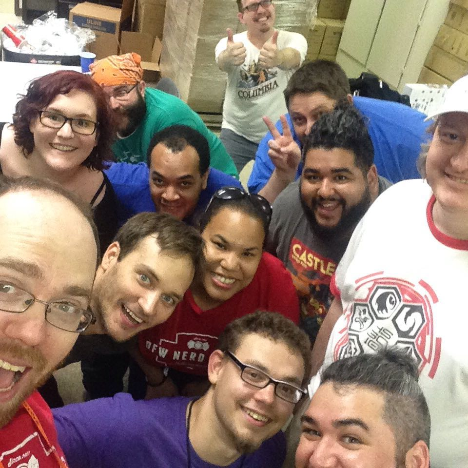
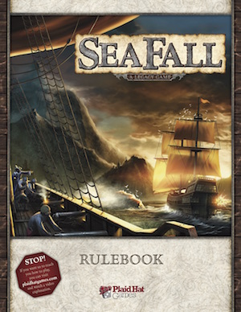
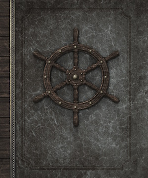

# SeaFall Preview: JR's Journey
## Designer Notes \#11: What was it like to work on SeaFall?
*2016-07-25*

Last summer Rob asked me to help "get SeaFall to the finish line," and hired me to be his developer. I'd previously heard of SeaFall, probably just like you did, from the buzz surrounding the game and some friends of mine who were playtesters for Plaid Hat Games.

Though I'd published a few small games and done a bit of dev work fro friends, SeaFall was immediately the most ambitious, largest project I'd ever worked on. Just the initial prototype kit and rules that Rob sent over were impressive. It's a big game, and a beautiful one, and I started where I think any evaluation of a prototype should start - I played the game.

*JR, a longtime friend of Plaid Hat Games, helped get SeaFall to the finish line. Here, JR (bottom left) takes a selfie with Plaid Hat Games staff and volunteers.*

I grabbed Cody and Aubrey (great friends of mine who both were interested in SeaFall and had a few weeks free last August) and played through 18 session of the game in about 3 weeks. I filled my notebook with questions, commentary, suggestions, and clarifications, and each morning Rob and I met for a few hours to talk through what had been done the day before. it was a crash course in how games are made from one of the greatest game designers in the world, and I'd be lying if I didn't say that some mornings I was just fighting to keep up and avoid saying anything stupid

As we played through that first campaign, a lot of things became clear: The game was incredibly ambitious, told an exhilarating story, and was big. B-I-G big. By the time I played it, Rob had already been through a few rounds of streamlining with Plaid Hat Games playtesters (who did a tremendous job providing feedback and critique the whole time I was on the project) and he'd significantly scaled down the scope of the game.

Even so, it was apparent that a big game left a lot of room for ambiguity that needed to be reigned in and defined. So, I set out on my second big task for Rob - creating a "punch list" of all the questions, issues, unresolved design things, and anything else we came up with as we talked. This list was as big as the game it came from - we ended up addressing hundreds of things over the next three months, all with a simple goal: to make SeaFall as accessible, streamlined, and worry-free as possible for the thousands of people who will play it.

Outside this, much of my time was spent on the two books that come with SeaFall: the rulebook and the Captain's Booke. When Rob and I started he had his own rules document, replete with shorthand, commentary, and artifacts from previous versions of the game. It was great for testing, but of course a final needed to be written. I wrote the first version of the final rulebook with Rob's assistance, and we relied on brilliant editorial work from playtesters, consultants, and translation staff in getting it as right as we could.

On top of this, the Captain's Booke and its nearly 500 entries had to be editied, checked for clarity and consistency, and constantly updated to stay current with ongoing changes to the story of SeaFall and the rules, outcomes, and encounters that the Booke describes.

This was the most challenging of all the parts of SeaFall for me, and the thing that absolutely had to be done right. If you've ever played Tales of the Arabian Nights or Above and Below, you've seen a story book with entries that are more-or-less unrelated to each other, or that exist in 2-3 entry "story chains." In SeaFall, not only do story chains like this comprise most of the book, there are also some spoilers for upcoming parts of the game, keys and triggers to things later needed, and a bunch of other things that would be spoilers if I mentioned them.

This meant the Booke needed to be 100% accurate and that we absolutely couldn't afford the kind "fatal" mistake that could cause a player to spoil themselves too early in the game, or worse, to miss a crucial trigger or story entry needed to progress the campaign. I put a lot of work into getting this right, just like everybody else on the project, Rob most of all, and I'm really happy with the result.

There were a few times during the fall that I thought we were "done" with SeaFall, but true to his nature, Rob never accepted "good enough" as the endpoint for this game. On one of our trips together, Rob told me that often, "the last thing you add to a game is the best," and I think this rings true of SeaFall. You'll have to to play the full campaign to judge for yourself, and I hope you do!

Much like an umpire at a baseball game, I think it's true that my work is best done if nobody notices my contributions at all. If SeaFall binds you in its spell, tells you a story you fall in love with, and provides a few dozen hours of fun for you and your friends and family, without ever seeming too complicated or too hard to understand, then I'll be ecstatic.

I hope you enjoy playing SeaFall as much as I enjoyed being a part of making it. Hug thanks to my wife, Amy, my playtesters, Cody and Aubrey, the Plaid Hat playtesters, the staff at Plaid Hat and Z-Man Games, and of course to Rob for inviting me to join him in this crazy endeavor, and to his family for putting up with so many visits and hours working in their kitchen.

If you're interested in more of what I learned while developing SeaFall, please read my article with The League of Gamemakers.

*Written by JR Honeycutt*  
*JR Honeycutt is a developer for SeaFall*

# Five Things I Learned While Developing SeaFall
*by JR Honeycutt*
*July 8, 2016*

Last summer I had the opportunity to work as the developer for SeaFall, a Legacy game from Rab Daviau and Plaid Hat Games that's set in a fictional world in the dawn of the Age of Sail. It's Rob's third published Legacy game (Risk Legacy, Pandemic Legacy: Season 1), and the first that was created from scratch, without incorporating an existing game.

I learned a lot working daily with Rob, and he pushed me to be a better designer and developer every day. Here are some things I learned while working with one of my heroes.

## 1. Player Experience is the most important thing

When I first started making games, I was completely convinced that they came from one of three places – theme, mechanics, or components. That’s where you’d start, right? The first time somebody told me, “It’s about the **player experience**” I shrugged it off like the new-age nonsense it was. Predictably, my first games were boring or hard to understand.

As it turns out, the nonsense isn’t nonsense. It’s the most important thing in a game. SeaFall is a long, intricate campaign that tells a story in no specific order, a story players both weave and have woven for them. The experience of being a part of the overall narrative is the most important part of the game.

Rob has said before that a legacy game only means that the game tells a story that players take a part in. That story has to be reinforced in every way possible – through the game mechanics, of course, and in what players do for themselves and to each other, how they gain information and use it, where they go and what they do. It all ties together to support this beautiful dive into a thematic, interesting world.

## 2. "Good Enough" isn't good enough

Every single game I’ve worked on has had a piece of it that fit pretty well, but didn’t exactly work the way I wanted or didn’t completely reinforce the theme of the game. As a developer, my job is to find those things and weed them out, to show them to the designer and ask, “Why is this here? And how could we do it better?”

I watched Rob pour hours into systems that already worked well, and pick through hundreds of playtest notes and questions to hone in on seemingly small issues. As it turned out, some of these issues gave us perspective into whole systems of SeaFall that were antiquated and could be updated, or removed altogether.

I told Rob that I thought SeaFall was a publishable, very good game the first time I played it, and we spent six more months on it after that. Before this experience, I never would have put that much extra work into a game I thought was already good enough. Lesson learned: ‘Good enough’ isn’t enough.

## 3. Solve the biggest problem first

Those long lists of notes and questions are called “punch lists” and they were the highlight of my morning for months. It’s tempting to start with the small things you know you can fix – “should I roll two dice, or three?” – but often that’s wasted work. Rob taught me pretty quickly that you should identify the one or two biggest problems you’re currently faced with, and solve them first.

SeaFall is a big game, and if we’d spent the time to solve every little problem first there would have been a lot of wasted time. As it was, we were able to revise and update quickly and efficiently, and push through sets of problems efficiently.

## 4. Every rule has a cost

I might be wrong about this, but I think every rule in a game has a cost. That cost is expressed in accessibility, in teaching time, in how often players will put a game on a table. People like to express mastery over things they understand, like to play games that make them feel smart and capable and confident. The fewer rules there are to understand, the more those rules flow naturally from the theme of the game, and the easier it is for players to develop the heuristics necessary to play well. Players that play a game well will play that game more often.

If a rule doesn’t make sense, or you can’t explain it easily, find a way to cut it. It’s that simple. Eric Lang has said in numerous places that inexperienced designers often want to fix problems by adding complexity. Rob showed me in SeaFall the virtue of addition by subtraction – masterful design work done by removing unneeded thing to introduce clarity and draw the focus to the best parts of the game.

I think about this every single day that I work on games now – what can I remove from this, what can I combine, what can I simplify, that will make it easier to get this to the table and bring the fun to light?

## 5. The last thing you add is often the best

In the late stages of development, Rob and I finally felt comfortable with where SeaFall was, and were very nearly ready to turn it over to Plaid Hat to print. As it turned out, there was still room for improvement, and it took playing the game with people with zero previous context to see this new, exciting design space.

Two days later Rob showed me an entire set of new additions that absolutely upgraded the game. At that point I was already in love with what he had created, but even so the new additions fit perfectly and seemed to reinforce the SeaFall theme even more than what we had. I was surprised Rob was willing to do that much destruction and creation when we were that close to the finish line, and yet here he was creating new systems that, in retrospect, are among the very coolest things that happen in SeaFall.

That’s a lesson that will stick with me always – even when you think you’re done, challenge that assumption, take the game to new places with open eyes and an open mind, and be willing to be humble about the thing you’ve created and still willing to improve it. That final push on SeaFall was one of the the most impressive creative things I’ve ever witnessed.

SeaFall is available for pre-order from Plaid Hat Games right now, and is set to be released later this year.
